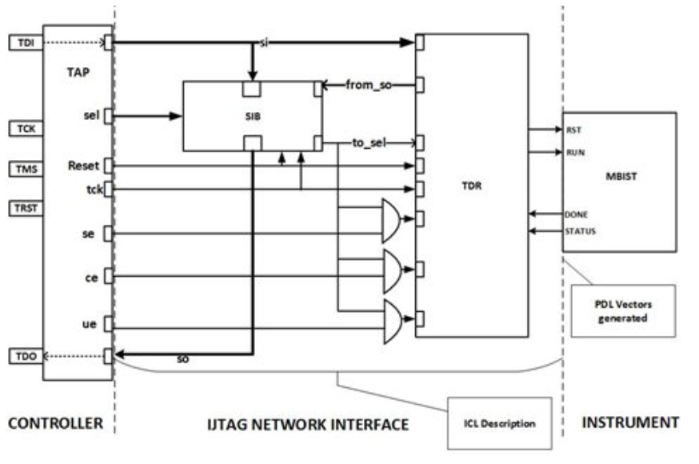

# IHP130-DFT-Memory-Subsystem
Standard-compliant DFT & IJTAG infrastructure for IHP 130nm Memory IP, featuring IEEE 1149.1, 1500, and 1687 (SIB) integration.

This project implements a robust Test Access Mechanism (TAM) for digital SoC designs. It bridges the gap between high-level JTAG controllers and embedded Hard IPs (IHP 130nm RAM) by integrating IEEE standards-compliant test infrastructure.

## Overview
This project implements a standards-compliant test infrastructure (IEEE 1149.1, 1500, 1687) integrated with a **Hard IP Memory** from the **IHP 130nm (SG13G2) PDK**. 

Unlike generic RTL projects, this implementation focuses on the practical integration of a Memory Wrapper and a reconfigurable Scan Path (IJTAG) to control an MBIST engine.

## Key Features
- **Foundry IP Integration**: Integrated IHP 256x8 1-Port RAM (`RM_IHPSG13_1P_256x8`).
- **Custom MBIST**: Implemented a dedicated controller to automate memory testing logic.
- **IEEE 1500 Wrapper**: Wrapped the memory core to provide standardized Test Access Mechanism (TAM).
- **Dynamic IJTAG Network**: Utilized **Segment Insertion Bits (SIB)** to manage the scan path, allowing efficient access to the MBIST instrument.

## Technical Details
- **PDK**: IHP 130nm SG13G2 Open Source PDK.
- **Clock Domain**: Single clock domain for JTAG/Memory test logic.
- **Verification**: Simulated using Icarus Verilog; Waveform analysis via GTKWave.

## How to Run Simulation
1. Ensure `iverilog` is installed.
2. Run the command:
   ```bash
   make sim
   ```

## Architecture Diagram
